:title: P2P for Servers
:hide-slide-numbers: true
:css: main.css
:js: keys.js

.. role:: big
   :class: big

----

:id: initial

P2P for Servers
===============

.. image:: qrcode.svg
   :alt: https://tailhook.github.io/ciruela-presentation/

----

:id: agenda

Agenda
------

* Patterns
* The Tool
* Use Cases

----

:data-x: agenda+1400
:data-y: agenda-1000

Why?
====

----

:id: arch-start
:data-x: r1400
:data-y: r0

.. image:: classic_arch.svg
   :width: 1200px

----

.. image:: classic_memcached_arch.svg
   :width: 1200px

----

:class: oneatatime

DB
==

* Persistent
* Relatively slow

----

:class: oneatatime

Cache
=====

* Quite fast
* Data loss is norm

----

:class: oneatatime

Source Code
===========

* Zero-cost
* Reliable
* Read-only

----

:class: oneatatime

Source Code
===========

Source code **can** contain data:

1. Gender options
2. Shop products
3. Game content
4. Site news

----

:class: oneatatime

Source Code
===========

* May have editable data
* CI/CD
* 3-5 :big:`🕴`

----

Takeaway
========

Source code **is** your DB until you have > 5 users.

.. image:: lektor.jpg
   :class: blog-logo
   :width: 400

.. image:: publii.svg
   :class: blog-logo
   :width: 400

----

DB? Cache? Code?
================

Currency Rates

(updated daily)

----

DB? Cache? Code?
================

Categories

.. image:: categories_wikipedia.svg
   :class: image-categories
   :height: 800

----

Categories
==========

.. image:: categories_operation.jpg
   :width: 1000

----

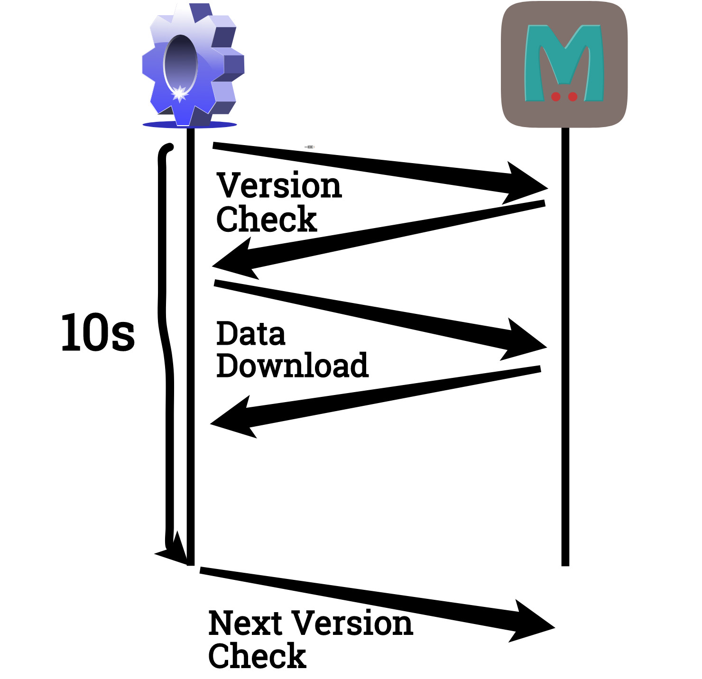

----

.. image:: congested_port.jpg
   :height: 800

----

:id: ciruela-links
:data-x: agenda+1400
:data-y: agenda+0

Ciruela
=======

* https://github.com/tailhook/ciruela
* https://ciruela.rtfd.org

.. image:: ciruela_qr.svg
   :alt: https://ciruela.rtfd.org/

----

:data-x: r1400
:data-y: r0

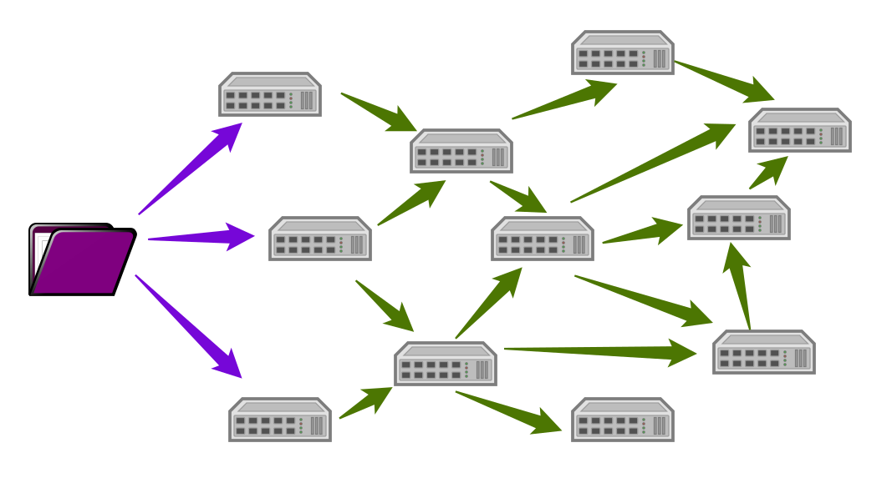

----

Thats It!
=========

----

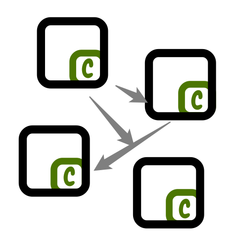

----

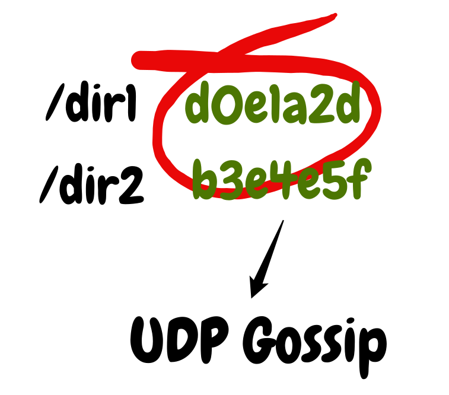

----

----

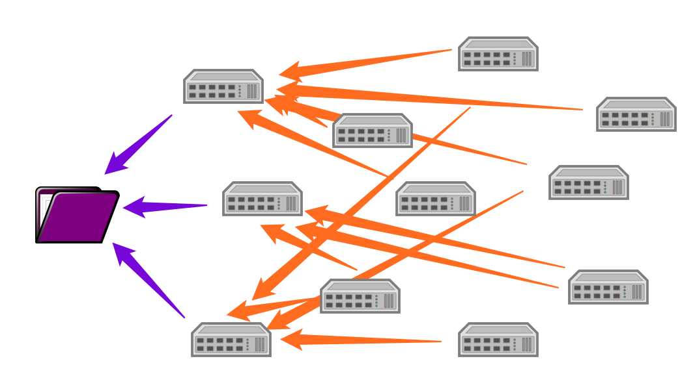

----

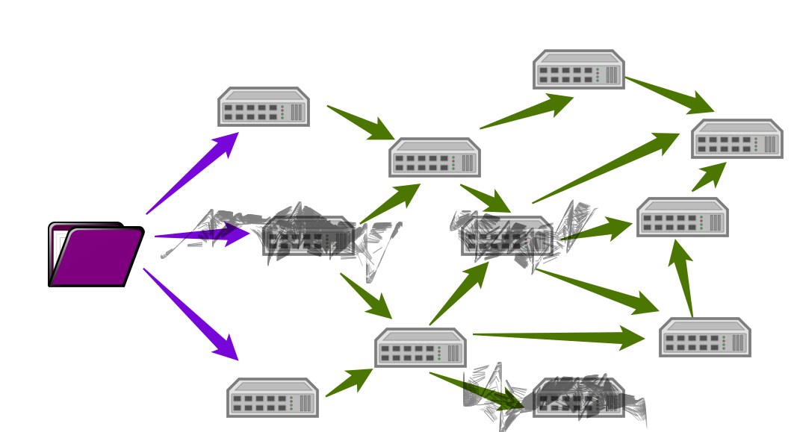

----

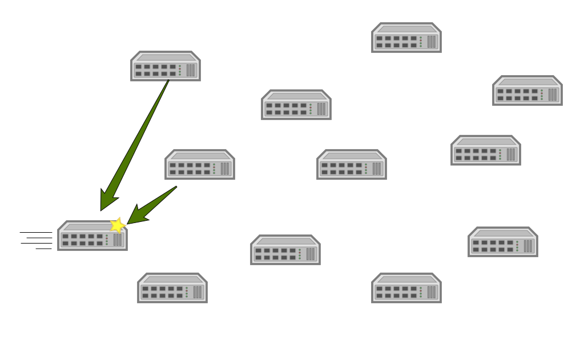

----

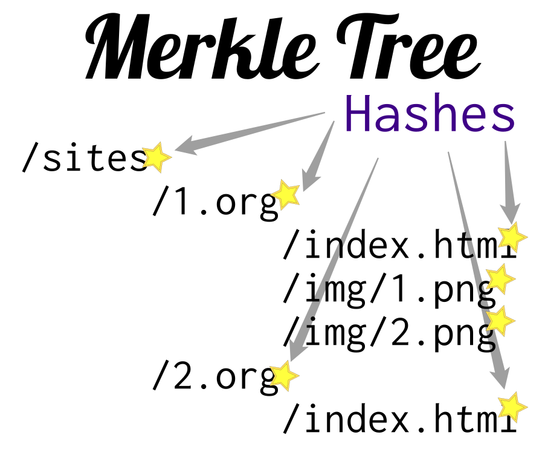

----

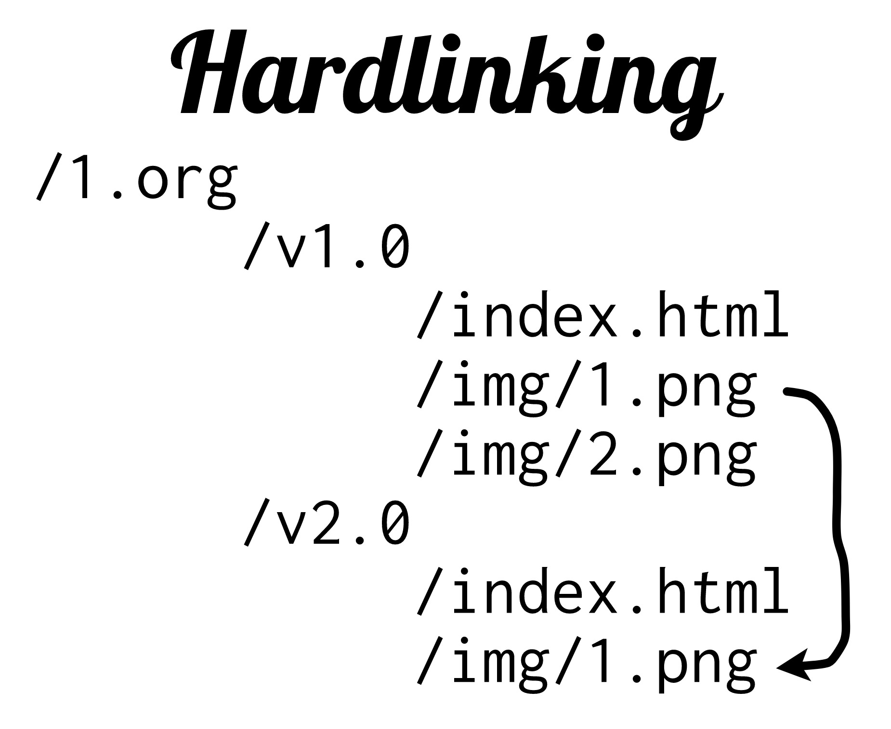

----

Hashes+Hardlinks
================

* Save disk space
* Save bandwidth

----

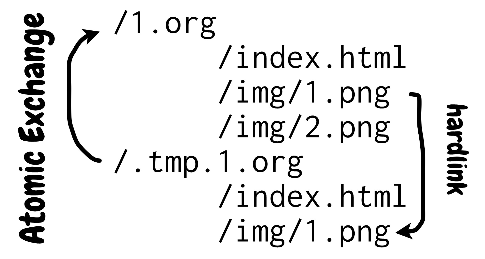

----

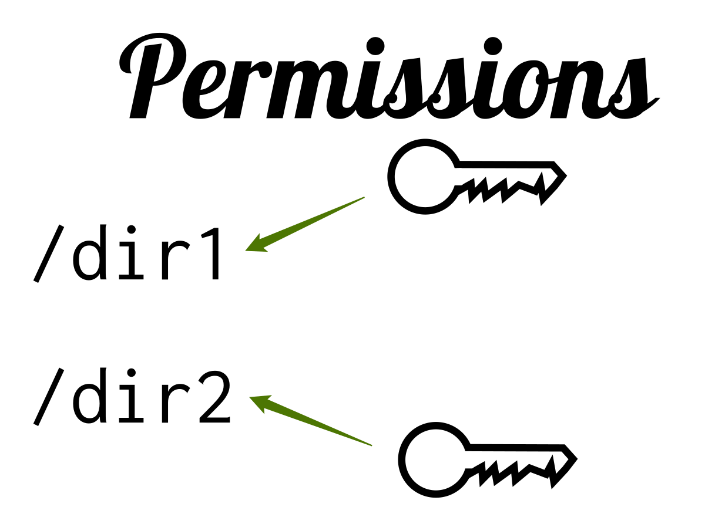

----

:id: dirs

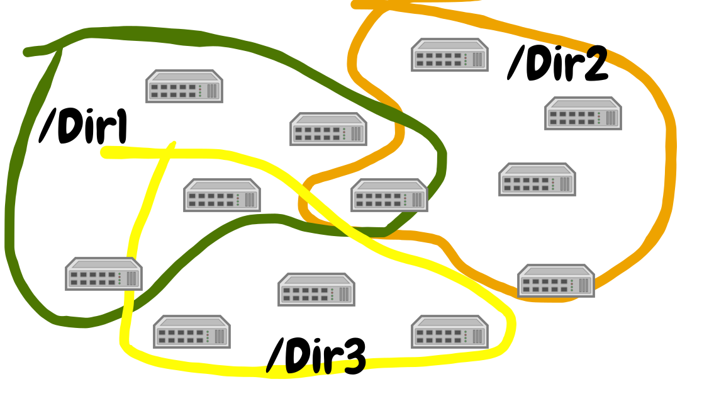

----

.. code-block:: text

   ciruela sync \
    --append ./local1:/dir1/v1.0.0 \
    --replace ./local2:/dir2/current \
    cluster1.org cluster2.org

----

:id: testimonials

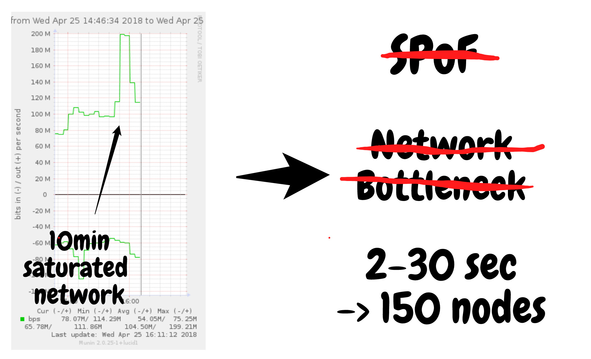

----

Security Warning
================

* TLS is on to do list
* Use behind firewall

----

:id: use-cases
:data-x: agenda+1400
:data-y: agenda+1000

Use Cases
=========

*… and to do's*

----

:data-x: r1400
:data-y: r0

Always Available
================

*… and dynamic*

* Site categories
* Currency rates
* Feature flags

----

Always Available
================

.. code-block:: python

   with open("/sync/cur/data.json") as f:
       return json.load(f)

*no network calls on start of app*

----

Cheap to Check
==============

.. code-block:: python

   dir = Path("/sync/cur")
   if dir.stat().st_ctime != old_time:
       return cache

----

Push New Data
=============

.. code-block:: python

   with tempfile.TemporaryDirectory() as d:
     with open(d.name+'/data.json', 'w') s f:
        json.dump(data, f)
     subprocess.check_call([
         'ciruela', 'sync',
         '--replace', d.name+':/sync/cur',
         'entry-point.example.org'])

----

Refreshable Things
==================

* Configs
* Translations
* Game content

*… removing file works!*

----

Limitations
===========

* Eventually consistent
* No concurrent updates

*… within single folder*

----

Distributed Data
================

* Search index replica
* Geo IP database

----

🕺 Edit on 100 Servers
======================

.. code-block:: text

   ciruela edit \
    -d /sync/cur -f /data.json \
    cluster1.org cluster2.org

----

Basic Things
============

* Container Images
* Static Sites
* Container Cache for Vagga

----

🕺 Debian Repository
====================

* Only download index
* Upload new index + .deb
* Atomically replace

----

Container Audit
===============

* Download index directly from cluster
* Check
* Remember hash

----

🕺 Transactional FS
===================

* Mount via fuse
* Download files on access
* Sync back on unmount

----

----

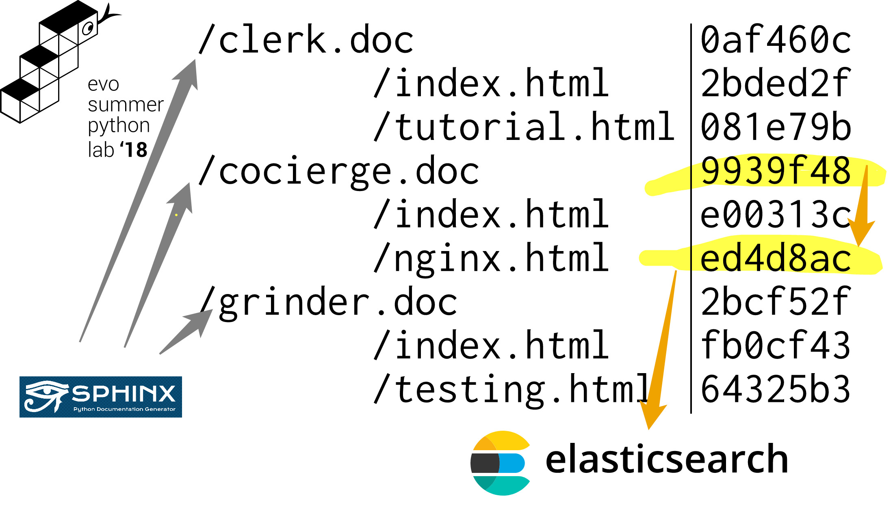

----

:id: questions
:data-x: initial+1000
:data-y: initial+0
:data-scale: 10

Questions
=========

.. container:: final_qrcode

    .. image:: qrcode.svg
       :width: 200px
       :alt: https://tailhook.github.io/ciruela-presentation/

    Presentation

.. container:: final-qrcode

    .. figure:: ciruela_qr.svg
       :width: 200px
       :figwidth: 200px
       :alt: https://ciruela.rtfd.org/

       Documentation

