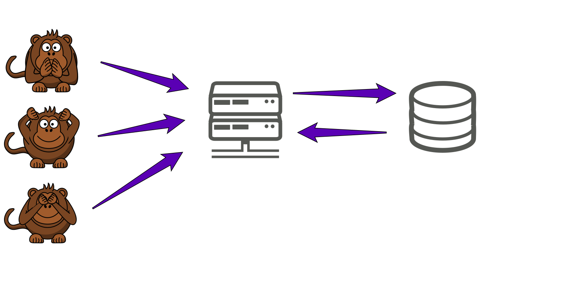
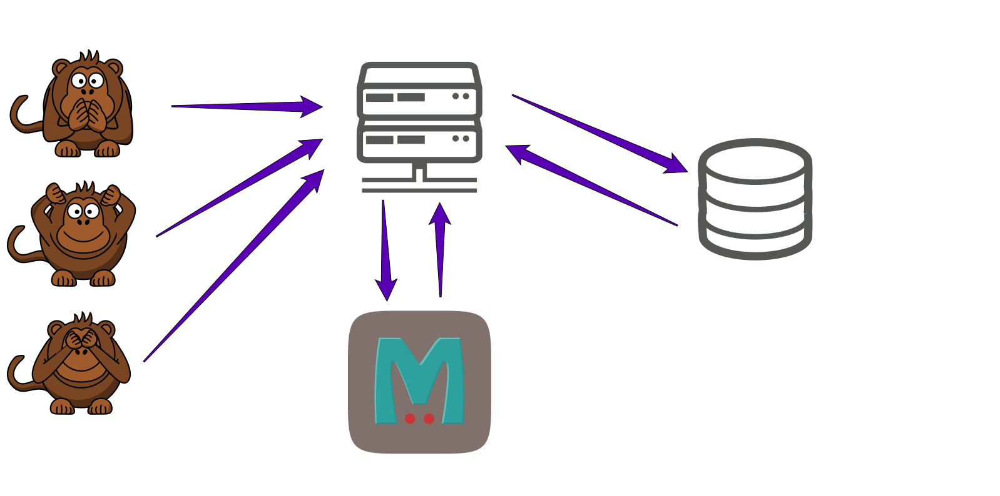
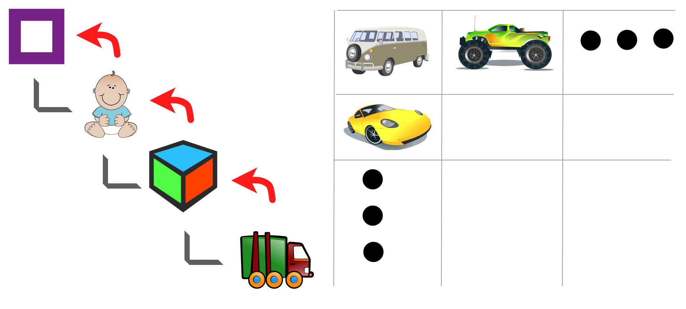
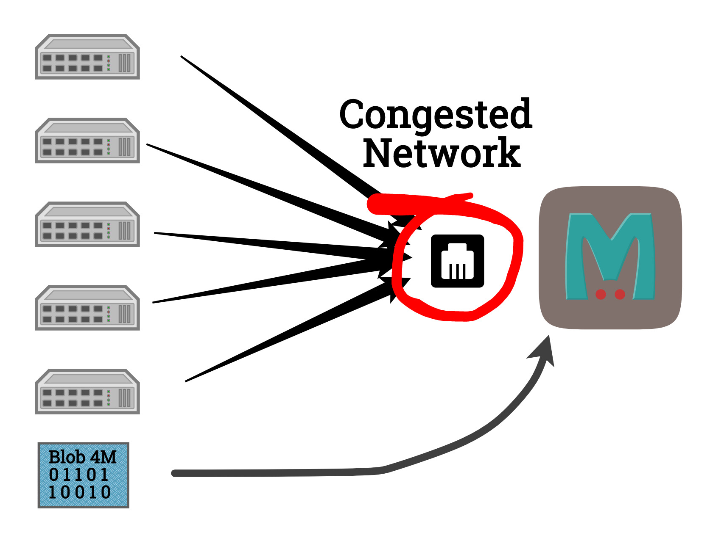

:title: P2P for Servers
:hide-slide-numbers: true
:css: main.css

.. role:: big
   :class: big

----

:id: initial

P2P for Servers
===============

----

:id: agenda

Agenda
------

* Patterns
* The Tool
* Use Cases

----

:data-x: agenda+1400
:data-y: agenda-1000

Why?
====

----

:data-x: r1400
:data-y: r0

----

----

:class: oneatatime

DB
==

* Persistent
* Relatively slow

----

:class: oneatatime

Cache
=====

* Quite fast
* Data loss is norm

----

:class: oneatatime

Source Code
===========

* Zero-cost
* Reliable
* Read-only

----

:class: oneatatime

Source Code
===========

Source code **can** contain data:

1. Gender options
2. Shop products
3. Game content
4. Site news

----

:class: oneatatime

Source Code
===========

* May have editable data
* CI/CD
* 3-5 :big:`🕴`

----

Takeaway
========

Source code **is** your DB until you have > 5 users.

----

DB? Cache? Code?
================

Currency Rates

(updated daily)

----

DB? Cache? Code?
================

Categories

.. image:: categories_wikipedia.svg
   :class: image-categories
   :height: 800

----

Categories
==========

----

----

:data-x: agenda+1400
:data-y: agenda+0

Ciruela
=======

* https://github.com/tailhook/ciruela
* https://ciruela.rtfd.org

----

:data-x: agenda+1400
:data-y: agenda+1000

Use Cases
=========

----

:data-x: r1400
:data-y: r0

.. code-block:: console

    > ciruela edit

----

:data-x: initial+1000
:data-y: initial+0
:data-scale: 10

Questions
=========

.. container:: final_qrcode

    .. image:: qrcode.svg
       :width: 200px
       :alt: https://tailhook.github.io/ciruela-presentation/

    Presentation

.. container:: final-qrcode

    .. figure:: ciruela_qr.svg
       :width: 200px
       :figwidth: 200px
       :alt: https://ciruela.rtfd.org/

       Documentation

